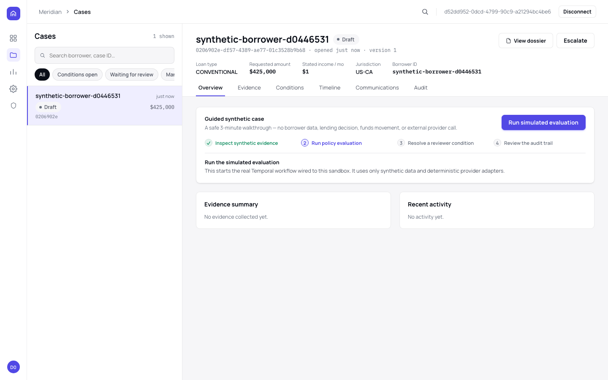
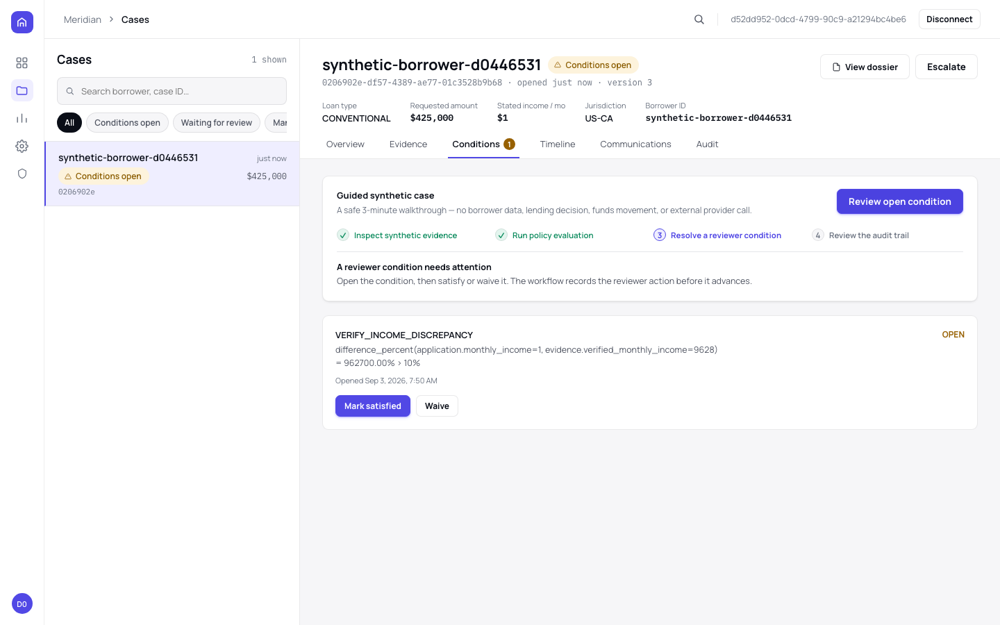
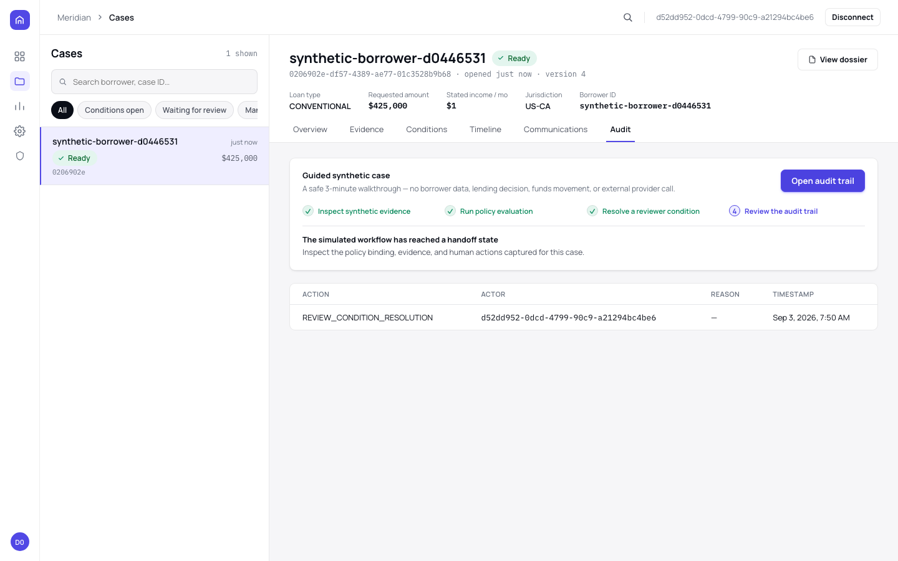

<div align="center">

# Meridian

**The governed operations workspace for lending teams that need every case action to be explainable.**

[](https://github.com/akira-in-tech/mortgage-integration-agent/actions/workflows/ci.yml)


Meridian turns a lending-case workflow into an accountable handoff: it gathers evidence through controlled adapters, binds the case to a policy context, lets a bounded AI planner assist with routing, and pauses for a reviewer whenever human judgment is required.

**[▶ Open the live synthetic demo](https://d136v61al3mroo.cloudfront.net)** &nbsp;·&nbsp; [Architecture](#architecture) &nbsp;·&nbsp; [Run locally](#run-locally)

> The live demo uses generated data only. It does not access a real borrower or provider, make a credit decision, move money, or represent a lender, regulator, GSE, or automated-underwriting finding.

</div>

## See the product in three minutes

The public sandbox is an isolated, disposable workspace — no sign-up or API key required. Every screenshot below is a live, unedited capture of that real sandbox, not a mockup.

<table>
<tr>
<td width="33%" valign="top">

<b>1 · Create &amp; evaluate</b><br>
<sub>Select <b>Try live sandbox</b> to create a tenant and a conventional-mortgage case, then run the real Temporal workflow against it.</sub>
</td>
<td width="33%" valign="top">

<b>2 · Review a condition</b><br>
<sub>The workflow opens a deliberately triggered income-verification condition. Satisfy or waive it as the sandbox reviewer.</sub>
</td>
<td width="33%" valign="top">

<b>3 · Inspect the audit trail</b><br>
<sub>Every workflow step, policy binding, evidence item, and reviewer action is recorded in order — nothing is inferred after the fact.</sub>
</td>
</tr>
</table>

Each sandbox uses an opaque `HttpOnly`, CSRF-protected session. It expires automatically, and its tenant-scoped synthetic records are removed after expiry.

## What Meridian gives an operations team

| Outcome | Meridian behavior |
| --- | --- |
| **Know what is blocking a case** | Durable workflows collect evidence, open explicit conditions, and wait without losing state when a worker restarts. |
| **Keep policy current and attributable** | Immutable policy bindings, source freshness checks, applicability guards, and impact assessments prevent silent reuse of stale or ambiguous policy. |
| **Use AI without delegating authority** | The optional private Qwen planner has a bounded schema and route set. Deterministic tools, budgets, validation, and human review remain authoritative. |
| **Explain every handoff** | Tenant isolation, consent/purpose checks, provider-operation lineage, reviewer actions, and chronological audit events preserve the evidence behind a case state. |
| **Introduce integrations deliberately** | Provider adapters, authorization gates, signed webhooks, REST/OpenAPI, GraphQL, and a generated TypeScript client create controlled ports for future approved integrations. |

## Product principles

- **Human authority is explicit.** Protected communications, exceptions, and reviewer conditions do not become automatic merely because an Agent proposed an action.
- **Policy is a control plane.** The workflow records which policy context it used and routes uncertainty to review instead of guessing.
- **The model is untrusted assistance.** It cannot write policy, bypass authorization, issue a formal lending decision, or invoke structurally excluded actions.
- **A synthetic demo is still privacy conscious.** The public environment creates isolated guest tenants, uses generated facts, and automatically purges expired workspaces.

## Architecture

```text
 React operations console       Partner REST / generated TypeScript client
            │                                      │
            └──────────────┬───────────────────────┘
                           ▼
                 NestJS API control plane
              GraphQL + REST/OpenAPI + OIDC
                           │
             ┌─────────────┼──────────────┐
             ▼             ▼              ▼
       Case domain    Policy control     Provider gateway
       + audit/outbox  + bindings         + authorization gates
             │             │              │
             └─────────────┼──────────────┘
                           ▼
                 Temporal durable workflow
                           │
                           ▼
               Bounded LangGraph.js Agent
          optional private Qwen planner + rules
                           │
              ┌────────────┴─────────────┐
              ▼                          ▼
     PostgreSQL + row-level security   Simulators / approved
     audit, lineage, policy records    provider adapter ports
```

| Layer | Technology |
| --- | --- |
| Operations console | React, Apollo Client, Vite, Vitest, Playwright |
| Control plane | NestJS, REST/OpenAPI, GraphQL/Apollo Server |
| Durable orchestration | Temporal |
| Agent runtime | LangGraph.js behind an `AgentRuntimePort` |
| Planner | Deterministic rules by default; optional schema-constrained Ollama + Qwen |
| Data and isolation | PostgreSQL 16, TypeORM, row-level security |
| Identity | OIDC/OAuth 2.0 or scoped API clients |
| Delivery | GitHub Actions, GitHub OIDC, Terraform, AWS ECS/RDS/CloudFront |

## Delivery confidence

- **Continuous integration** runs on pushes and pull requests: linting, builds, migrations, unit/integration/Temporal tests, browser tests, generated-contract drift checks, dependency auditing, secret scanning, SAST, container builds, and observability configuration validation.
- **Protected staging delivery** is intentionally manual because it changes persistent AWS resources. It uses GitHub OIDC rather than stored cloud credentials, publishes immutable application and Qwen images, records SBOM/provenance attestations, applies Terraform, publishes the console, and verifies the API and public HTTPS edge.
- **Operational evidence** is documented in the [development log](docs/DEVELOPMENT_LOG.md) and [operator runbook](docs/OPERATIONS.md). The environment remains a persistent synthetic staging demo, not a production lending deployment.

## Run locally

### Fastest path

```bash
npm install
npm run demo
```

This runs the zero-cost deterministic command-line demo. No model server, API key, or database is required.

### Full local workspace

```bash
# Deterministic workflow and simulated providers
docker compose up

# Optional local open-weight planner; Ollama must be available locally
DECISION_PROVIDER=ollama docker compose up
```

The full stack starts PostgreSQL, Temporal, Keycloak, the API, and the worker. Run the React console separately:

```bash
cd console
npm install
npm run dev
```

To use the configured local model outside Docker:

```bash
ollama pull qwen3.5:9b
ollama serve
DECISION_PROVIDER=ollama npm run start:dev
DECISION_PROVIDER=ollama npm run start:worker:dev
```

The planner receives only server-owned enums and booleans for its bounded routing task. It never receives borrower values, sets policy, approves communications, or causes side effects. Thinking is disabled because this task uses a budgeted structured response, not an unbounded reasoning trace.

## Boundaries that matter

Meridian is an integration-ready architecture and synthetic product demo. It deliberately does **not** claim:

- reviewed jurisdictional policy coverage or legal advice;
- authorization to use real borrower data or real provider credentials;
- a formal credit decision, approval, denial, rate lock, or clear-to-close;
- funds movement, settlement, funding, servicing payments, or capital delivery; or
- provider certification or automated-underwriting equivalence.

Those capabilities require separately governed providers, legal and operational approval, real-data controls, and release evidence.

## Documentation

- [Project charter](docs/PROJECT_CHARTER.md) — normative product and engineering contract
- [Development log](docs/DEVELOPMENT_LOG.md) — append-only implementation and verification record
- [Operations runbook](docs/OPERATIONS.md) — synthetic-environment telemetry, SLOs, drills, and incident procedures
- [OpenAPI contract](openapi/openapi.json) — generated REST contract
- [TypeScript client](client/) — generated client and integration examples

## License

This repository is intended as a portfolio and engineering demonstration. Review the repository license and all third-party model/provider terms before any use beyond the included synthetic environment.
